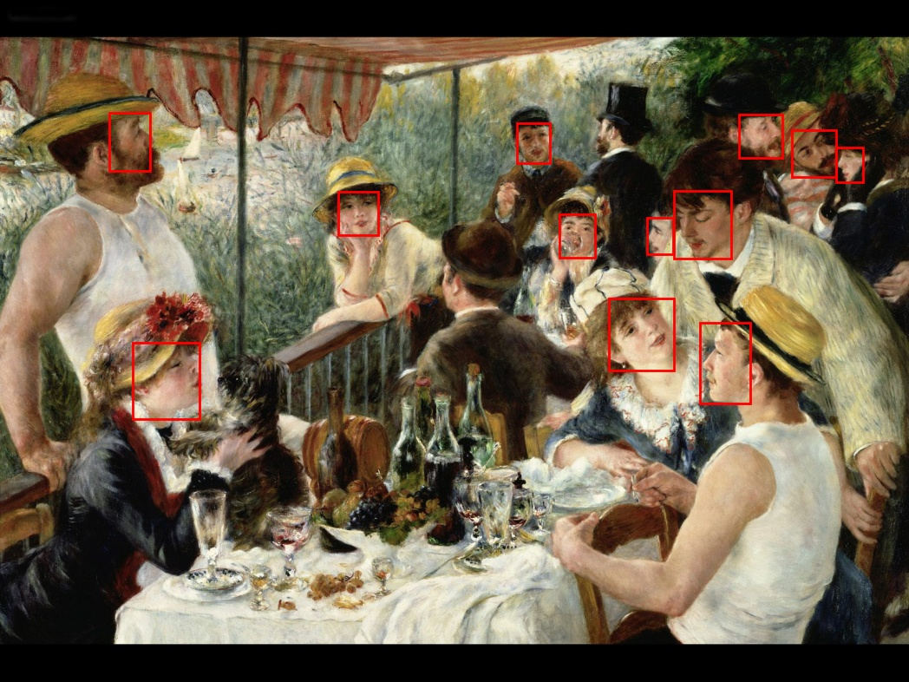
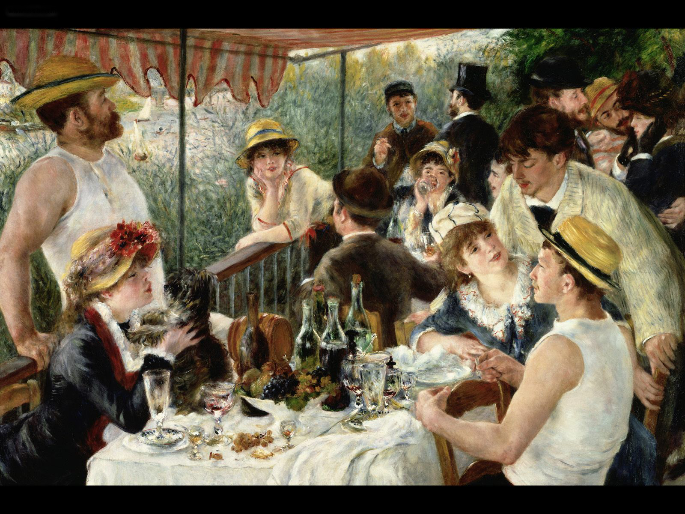

# gesicht
A short experiment on face detection using MTCNN (Multi-Task Cascade Convolutional Networks, arXiv: https://arxiv.org/abs/1604.02878) on Pierre-Auguste Renoir's "Le déjeuner des canotiers" (1881).

Output image:

Input image (for reference):

